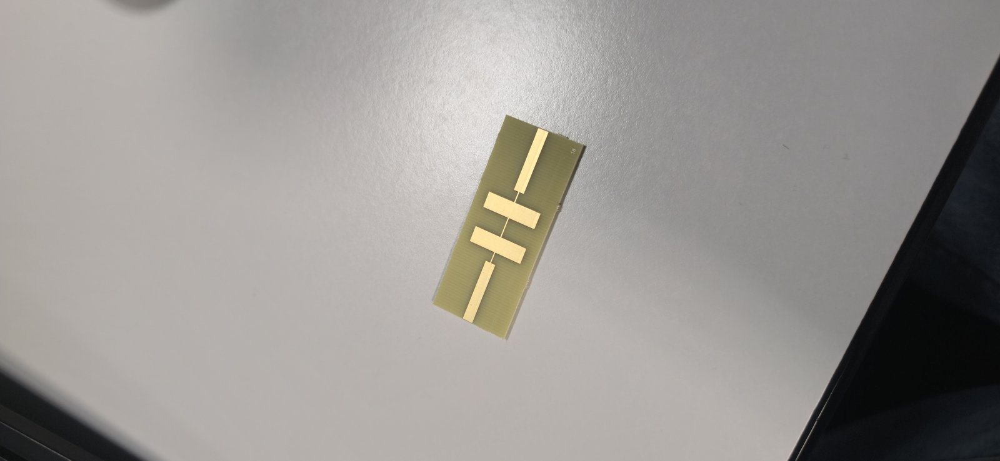
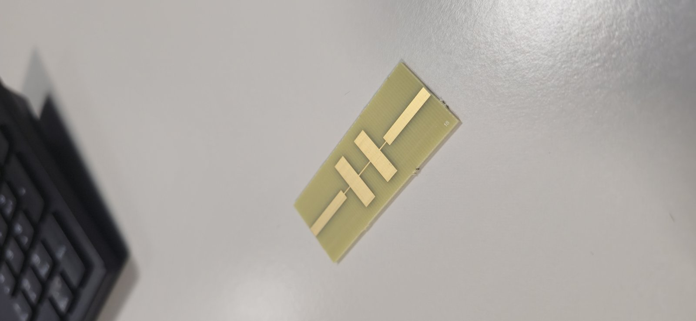
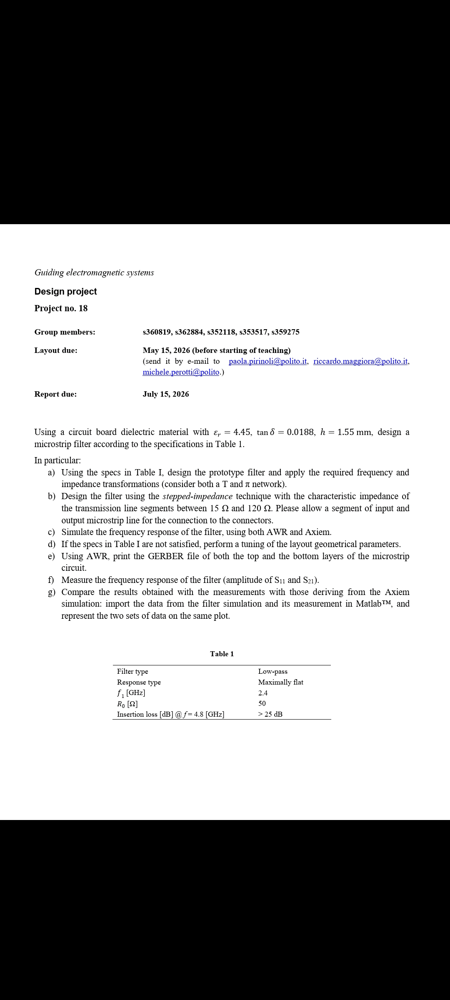
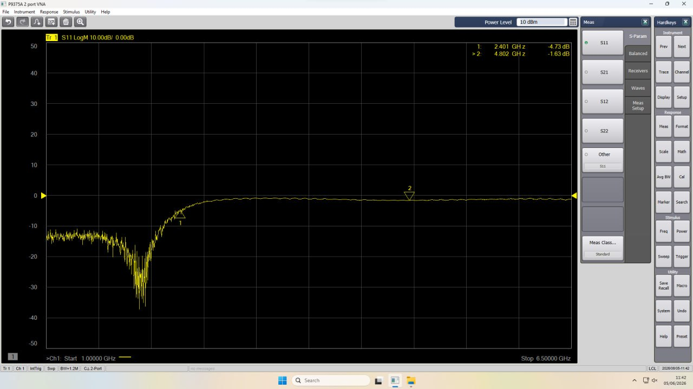
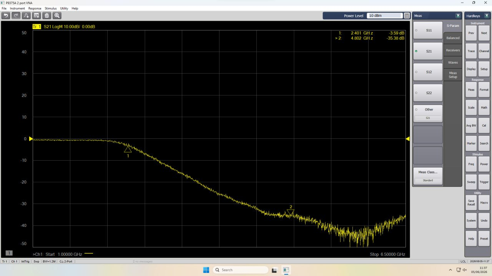
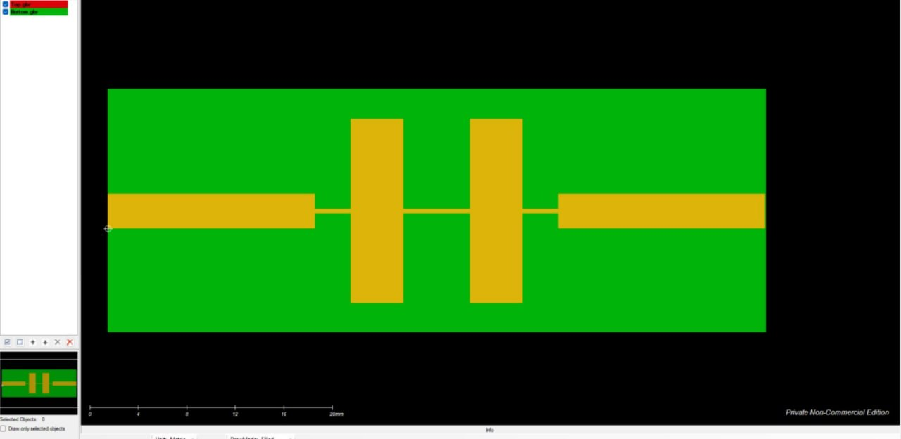
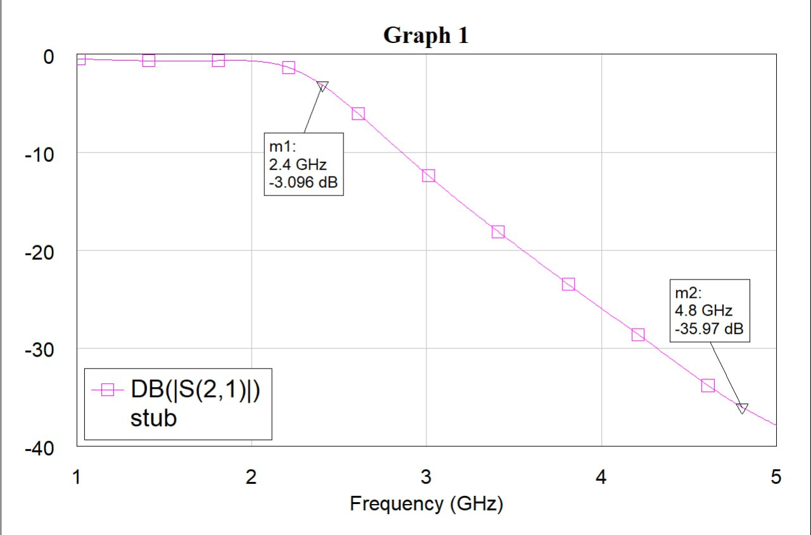
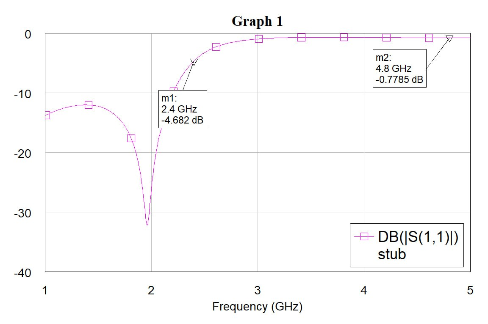

# Microstrip Stepped-Impedance Low-Pass Filter (2.4 GHz)

Design, electromagnetic simulation, fabrication and measurement of a maximally flat (Butterworth)
low-pass filter on a microstrip PCB.  
*Course: Guiding Electromagnetic Systems — Politecnico di Torino, June 2026.*

<p>
  
  
</p>

## Specifications

| Parameter | Value |
|---|---|
| Response | Maximally flat (Butterworth) low-pass |
| Cut-off frequency (−3 dB) | 2.4 GHz |
| Stop-band attenuation | ≥ 25 dB at 4.8 GHz |
| Substrate | εr = 4.45, tan δ = 0.0188, h = 1.55 mm |
| Port impedance | 50 Ω |

## Design flow

1. **Prototype and order.** With ωs/ωc = 2, a 5th-order Butterworth prototype gives more than 30 dB
   at 4.8 GHz, which meets the 25 dB requirement. Normalized element values:
   g = [0.618, 1.618, 2.000, 1.618, 0.618].
2. **Stepped-impedance implementation.** Series inductors become high-impedance lines (120 Ω) and
   shunt capacitors become low-impedance lines (15 Ω), with 50 Ω access lines. Electrical lengths
   are computed by [`matlab/impedance_synthesis.m`](matlab/impedance_synthesis.m) for both the
   capacitor-first (π) and inductor-first (T) configurations, then converted to physical widths
   and lengths with the microstrip synthesis equations.
3. **Circuit simulation and tuning** in AWR Microwave Office. Step discontinuities shifted the
   cut-off frequency, so the section lengths were optimized to bring the −3 dB point back to 2.4 GHz.
4. **EM verification** of the full layout with AXIEM, which captures fringing fields, coupling
   between sections and radiation losses.
5. **Fabrication** from the exported Gerber files, with SMA connectors on the 50 Ω lines.
6. **Measurement** with a Keysight P9375A vector network analyzer. The Touchstone (.s2p) data are
   compared with the AXIEM results by [`matlab/compare_simulation_measurement.m`](matlab/compare_simulation_measurement.m).

## Results

| | Specification | Measured |
|---|---|---|
| −3 dB cut-off | 2.4 GHz | 2.4 GHz |
| Attenuation at 4.8 GHz | ≥ 25 dB | ≈ 35 dB |

Measured and EM-simulated S-parameters agree closely. The small differences (slightly higher
pass-band insertion loss, shifted ripple) are explained by etching tolerances on the extreme
15 Ω / 120 Ω lines, parasitics of the soldered SMA connectors, and the spread of the nominal
substrate parameters over frequency.

## Repository contents

```
matlab/impedance_synthesis.m               lumped values and electrical lengths of each section
matlab/compare_simulation_measurement.m    AXIEM vs. VNA plots of S11 and S21
awr/pr18_awr.vin                           AWR Microwave Office project
docs/report.pdf                            project report
docs/img/                                  photos of the prototype and measurement setup
```

`compare_simulation_measurement.m` needs the RF Toolbox (`sparameters`) and the exported data
files `S11_measurements_AWR.txt`, `S21_measurements_AWR.txt` and `S_Analyzer.s2p` in the same
folder; the measurement data are not included in this repository.

## Gallery

| | |
|---|---|
|  |  |
|  |  |
|  |  |

## Team

Jyotiraditya Satpathy, Matteo Scardovi, **Lorenzo Pavone**, Samuele Martello, Andrea Lanzilotto.

